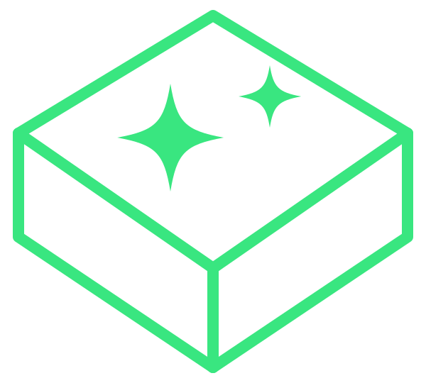

<p align="center">
  
</p>

<h1 align="center">AgentBox</h1>

<p align="center"><strong>Run reusable agents in isolated, fully-captured environments, with tight control over the tools and resources each one gets.</strong></p>

Running agents is usually ad hoc. Every setup has its own config, credentials,
and tools. There is nowhere shared to keep an agent with the resources it needs.
Nothing keeps one agent out of another's environment. And there is no record to
tell whether a change made an agent better or worse.

AgentBox fixes that. You define an agent once and run it in a sandbox scoped to
exactly the tools you allow. Every run comes back captured in full: transcript,
tokens, cost, timing, and tool calls. The same agent runs on many backends
through one API.

It is built on three ideas:

- **Isolated.** Each run gets its own workspace, scoped to only the tools and resources you grant.
- **Reusable.** An agent, its prompt, schema, and resources are defined once and run anywhere.
- **Measurable.** Every run is captured and can be scored, so quality is tracked, not guessed.

## Quick start

AgentBox runs as a Docker image and serves its API and dashboard on port `8765`.

```bash
git clone <your-agentbox-remote> agentbox
cd agentbox
docker compose build agentbox
docker compose up -d agentbox
```

Database setup and default profiles run on first start. Open
**http://localhost:8765** for the dashboard, then start a run. This one uses the
seeded local profile, so it needs no credentials. Just a local
[Ollama](https://ollama.com) with `ollama pull llama3`:

```bash
curl -X POST http://localhost:8765/api/runs \
  -H 'content-type: application/json' \
  -d '{"agent": "demo", "input": "List the files you can see.", "runner_profile": "ollama-local"}'
```

Cloud providers need credentials. Add them from **Settings** in the dashboard.

## How it works

**1. Point it at a model.** A runner profile bundles a provider and a model.
Configure the one you want in the dashboard. Local models need no key. Cloud
providers take an API key.

**2. Create an agent.** Use the **New agent** wizard in the dashboard. An agent
is a system prompt plus the resources and tools it is allowed to use. Everything
lives in a database, so there are no files to manage. Every edit becomes a new
version you can roll back to.

**3. Give it resources.** Documents, schemas, and scripts are versioned objects
you attach once and reuse across agents. Bind them into the prompt or drop them
as files in the workspace. The dashboard shows exactly how the final prompt is
assembled, piece by piece.

**4. Run it.** Send a request to `/api/runs`. The run executes in an isolated
workspace and streams as it goes. Watch it live in the dashboard, then browse the
full transcript, tool calls, and usage.

```bash
curl -X POST http://localhost:8765/api/runs \
  -H 'content-type: application/json' \
  -d '{"agent": "research-analyst", "input": "Summarize this abstract: ..."}'
```

**5. Get structured output.** Attach a JSON schema and AgentBox validates the
result. If it does not match, the run retries up to a limit you set. Downstream
code gets a shape it can rely on.

**6. Score and improve.** Rate any run 0 to 5 and leave a comment. Ratings and
usage roll up per version. After you tweak a prompt or swap a resource, you can
see whether quality, tokens, or time actually moved.

**7. Compare backends.** The agent stays the same no matter what runs it. Point
one run at a different backend and compare tokens, cost, time, and rating side by
side.

## Core concepts

| Concept | What it is |
|---|---|
| **Agent** | A named definition: a prompt, an optional output schema, and a profile. |
| **Workspace** | The isolated environment a run executes in. Fresh per run, or reused. |
| **Resource** | A typed, versioned input: a document, schema, or script. |
| **Run** | One execution of an agent, captured in full. |

## A note on isolation

A run is scoped to its workspace and the tools you allow. This is
filesystem-level scoping, not an OS-level sandbox. A backend with shell access
can reach the host. Grant tool access only to agents you trust, and run AgentBox
on infrastructure you control.
