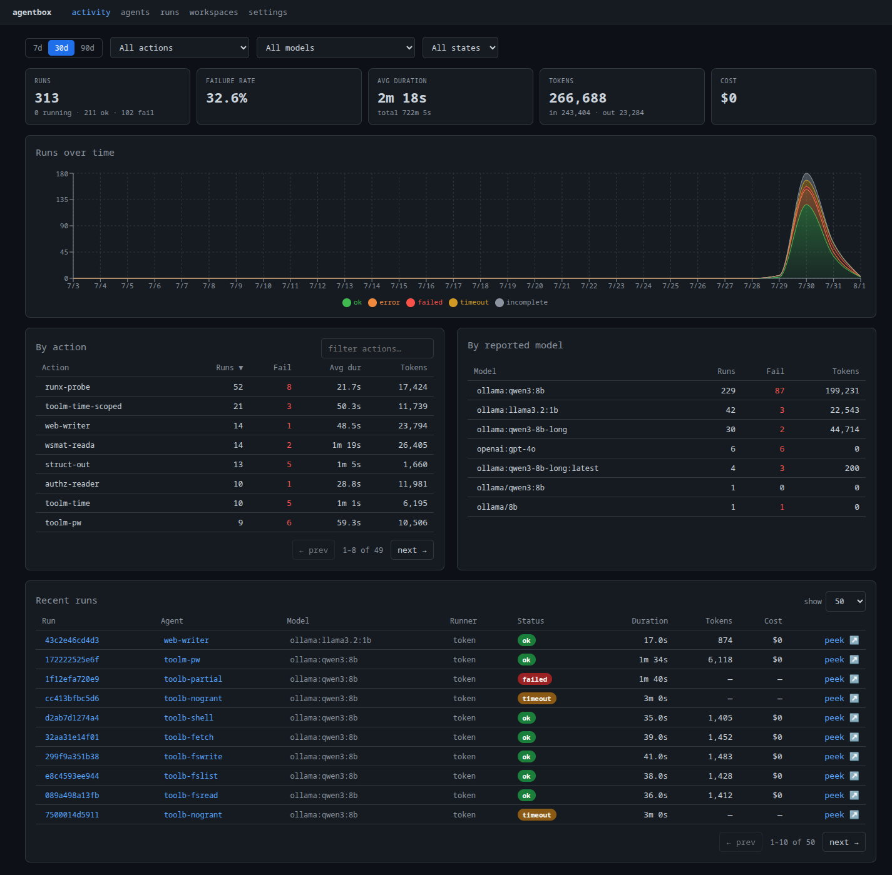

# Setup

Build and start AgentBox. The service runs with **no credentials**: a model
provider is configured in the [next step](02-setup-providers.md), and only
for the provider actually in use. Once the system is up and one provider is
configured, an agent can be [created and run](03-first-agent.md).

---

## Build the image

AgentBox ships as a Docker image containing the FastAPI service, the CLI, and
the prebuilt dashboard.

```bash
git clone https://github.com/Chamartin3/agentbox.git
cd agentbox
docker compose build agentbox
```

## Start the service

```bash
docker compose up -d agentbox
```

The service **initializes its database automatically on first start** (Alembic
migrations run at boot; there is no separate migrate command) and **seeds
default runner profiles**, one per provider, ready to enable in the next step.
The container owns two named volumes by default:

| Volume | Mount | Holds |
|---|---|---|
| `agentbox-data` | `/data` | SQLite database + run transcripts |
| `agentbox-creds` | `/agentbox/creds` | All backend credentials; each backend in its own subdir |

Both are relocatable: set `AGENTBOX_DATA_VOLUME` or `AGENTBOX_CREDS_VOLUME` to a
host path (e.g. `./data`) to bind-mount instead of using the named volume. Leave
them unset to keep the container-owned named volumes above.

### Customize the endpoints

The image serves two things: the **API** (plus dashboard) and a separate **MCP**
server. Both listen on fixed ports inside the container (`8765` and `8766`); what
you customize is the host port each is published on, set in your `.env` or
compose environment.

| Variable | Default | What it controls |
|---|---|---|
| `AGENTBOX_PORT` | `8765` | Host port the API and dashboard are published on |
| `AGENTBOX_CONTAINER_NAME` | `agentbox` | API container name |
| `AGENTBOX_MCP_PORT` | `8766` | Host port the MCP server is published on |
| `AGENTBOX_MCP_HOST` | `0.0.0.0` | Interface the MCP server binds inside the container |
| `AGENTBOX_MCP_TRANSPORT` | `http` (in compose) | MCP transport: `http` exposes streamable HTTP at `/mcp`; `stdio` for a local pipe |
| `AGENTBOX_MCP_CONTAINER_NAME` | `agentbox-mcp` | MCP container name |

For example, to move both off the defaults:

```bash
# .env
AGENTBOX_PORT=9000
AGENTBOX_MCP_PORT=9001
```

The API is then at `http://localhost:9000` and MCP at `http://localhost:9001/mcp`.
On the shared docker network, other services still reach them by container name
and internal port (`http://agentbox:8765`, `http://agentbox-mcp:8766/mcp`).

Verify it is healthy:

```bash
curl -s http://localhost:8765/api/runs | head
# -> {"items": [], "total": 0, ...}  (empty run list)
```

## Open the dashboard

Open the AgentBox dashboard in a browser. The **Activity** landing page is
the home base: run volume over time, failure rate, token and cost totals, and a
live feed of recent runs. On a fresh instance it starts empty and fills in as
agents run — the capture below is an instance with history.

<figure markdown>
  
  <figcaption>The Activity dashboard: runs over time, failure rate, token/cost totals, per-action and per-model breakdowns, and a live recent-runs feed.</figcaption>
</figure>

---

<a id="isolation"></a>

!!! warning "Isolation boundary: read before granting shell access"
    A run is isolated to its workspace directory and the tools it is allowed. This
    is filesystem-level scoping, **not** an OS-level sandbox. A backend with
    shell access can reach the host. Only grant shell/tool access to trusted
    agents, and run AgentBox on controlled infrastructure.

Next: **[Configuring a provider →](02-setup-providers.md)**
