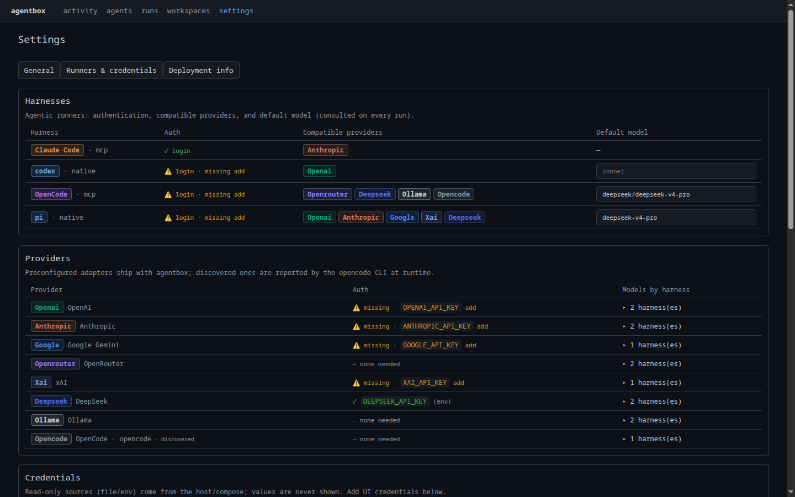

# Configurar un proveedor

Antes de que un agente pueda ejecutarse, AgentBox necesita saber **qué lo
ejecuta** y **cómo autenticarse**. Ambas cosas viven en un mismo objeto: un
**perfil de runner**. Este paso es opcional y depende de qué modelo use el
agente. Solo hay que configurar el perfil que realmente se ejecuta.

## Qué es un perfil de runner { #what-a-runner-profile-is }

Un perfil de runner es lo que un agente selecciona en el momento de la
ejecución. Se compone de tres partes:

- **Proveedor** (*quién sirve el modelo*): `openai`, `anthropic`, `google`,
  `xai`, `deepseek`, `openrouter`, `ollama`, …
- **Harness** (*cómo se dirige el modelo*). El harness `token` llama a la API
  del proveedor en el mismo proceso. `claude_code`, `opencode`, `codex` y `pi`
  dirigen cada uno un agente de programación CLI real como subproceso. (En la
  CLI este campo es `--backend`.)
- **Modelo** (*qué modelo* le pide el harness al proveedor). Es opcional:
  cuando se omite, lo elige el harness/proveedor.

`Provider + Harness + Model` + credenciales = un perfil ejecutable.

## Configúralo en el panel

Abre **Settings → Runners & credentials**. Es la forma más rápida de ver el
panorama completo: qué harnesses están autenticados, qué proveedores todavía
necesitan una clave y el modelo por defecto que usa cada harness.

<figure markdown>
  
  <figcaption>Settings → Runners & credentials: estado de autenticación de cada harness, estado de la clave de API por proveedor y modelos por defecto — todo en un solo lugar.</figcaption>
</figure>

- **Harnesses** — cada fila muestra su autenticación (`✓ login` o `⚠ login ·
  missing`), los proveedores compatibles y un modelo por defecto que puede
  fijarse en línea.
- **Providers** — cada uno indica si su clave de API está presente (`✓`) o
  ausente (`⚠`); haz clic en **add** junto a un proveedor para guardar su clave
  desde el navegador.
- **Credentials** — el panel de abajo lista lo que ya está configurado (desde
  archivo/entorno o añadido en la interfaz); los valores nunca se vuelven a
  mostrar.

Gestiona los **perfiles** de runner en sí en **Runners**, en la navegación
superior — añade, edita o elimina las combinaciones de `Provider + Harness +
Model` que los agentes seleccionan en el momento de la ejecución.

## O gestiona los perfiles desde la CLI

Los mismos perfiles viven en `agentbox engine profile`:

```bash
docker compose exec agentbox agentbox engine profile ls
docker compose exec agentbox agentbox engine profile new \
  --id my-claude --name "Claude via CLI" \
  --backend claude_code --provider anthropic
```

!!! note "Perfiles de inicio"
    Una instancia nueva incluye un puñado de perfiles de inicio para que `run`
    funcione de inmediato. Trátalos como ejemplos, no como recomendaciones. Usa
    `engine profile rm` para los que no quieras, y `new` para perfiles
    personalizados.

## Tres formas de autenticarse

Un harness no lleva sus propias credenciales. Estas se suministran de una de
tres formas, y **las formas disponibles dependen del harness.**

!!! tip "En el panel"
    Para simples **tokens de API**, el camino más rápido es **Settings →
    Runners & credentials → add** junto al proveedor (mostrado arriba) — sin
    necesidad de la terminal. Los **logins de harness** (los flujos de OAuth de
    más abajo) son interactivos y se ejecutan dentro de la caja, así que se
    quedan en la CLI.

**1. Token de API**: una clave de API de proveedor, leída desde una variable de
entorno. Solicita y guarda una:

```bash
docker compose exec agentbox agentbox engine cred setup openai
# asks for OPENAI_API_KEY, writes it to the creds env file
```

**2. Login de harness**: autentícate *dentro de la caja* con el propio flujo de
OAuth del harness. Esto usa una suscripción existente de Claude / OpenCode /
Codex, así que no hace falta una clave de API:

```bash
docker compose exec -it agentbox agentbox engine cred setup claude_code
# runs `claude /login` interactively
```

**3. Credenciales importadas**: copia un login existente desde la máquina
anfitriona a la caja, en lugar de volver a iniciar sesión:

```bash
docker compose exec agentbox agentbox engine cred import claude_code
# copies host ~/.claude/.credentials.json into the creds volume
```

Cualquier cosa que se guarde, ya sean claves de entorno o tokens de OAuth,
aterriza bajo `creds/` en el volumen `agentbox-creds`, así que sobrevive a la
recreación del contenedor. Ejecuta `agentbox engine cred setup` **sin
argumento** para un recorrido interactivo por cada harness, o `cred status`
para ver lo que ya está configurado.

### Qué harness admite qué

| Harness | Token de API | Login de harness | Importar creds del anfitrión |
|---|---|---|---|
| `token` | ✅ clave del proveedor | ✗ | ✗ |
| `claude_code` | ✅ `ANTHROPIC_API_KEY` | ✅ `claude /login` | ✅ `~/.claude` |
| `opencode` | ✅ clave `OPENAI` / `OPENROUTER` | ✅ `opencode login` | ✅ `~/.local/share/opencode/auth.json` |
| `codex` | ✅ `CODEX_API_KEY` / `OPENAI_API_KEY` | ✅ `codex login` | ✗ |
| `pi` | ✗ | ✅ `pi login` | ✗ |

## Configuración específica por proveedor

La mayoría de los proveedores quedan cubiertos por los tres métodos de arriba.
Dos casos necesitan un poco más.

=== "Claves de API en bloque"

    Para conectar varios proveedores del harness `token` a la vez, deja un
    `.env` junto a `docker-compose.yml` solo con las claves en uso, y luego
    reinicia. Cada perfil `token` incluido lee su clave desde la variable
    correspondiente:

    ```bash title=".env"
    OPENAI_API_KEY=sk-...
    ANTHROPIC_API_KEY=sk-ant-...
    GOOGLE_API_KEY=...
    XAI_API_KEY=...
    OPENROUTER_API_KEY=...
    ```

    ```bash
    docker compose up -d agentbox   # restart to pick up the new env
    ```

=== "Ollama (sin credenciales)"

    Este es el camino sin credenciales: ejecuta Ollama como un **contenedor
    hermano** para que no se instale nada en el anfitrión.

    **1. Añade un servicio de Ollama** con un archivo de override:

    ```yaml title="docker-compose.override.yml"
    services:
      ollama:
        image: ollama/ollama
        volumes:
          - ollama:/root/.ollama
      agentbox:
        depends_on:
          - ollama
    volumes:
      ollama:
    ```

    **2. Inícialo y descarga un modelo** (en el contenedor de Ollama):

    ```bash
    docker compose up -d
    docker compose exec ollama ollama pull llama3
    ```

    **3. Crea un perfil de runner** apuntando al contenedor. Los servicios de
    Compose se alcanzan entre sí por nombre, así que la URL base es
    `http://ollama:11434`:

    ```bash
    agentbox engine profile new \
      --id ollama --name "Ollama (container)" \
      --backend token --provider ollama \
      --model ollama:llama3 --base-url http://ollama:11434
    ```

!!! tip "Ollama en el anfitrión en lugar de un contenedor"
    Un perfil `ollama-local` incluido apunta a `http://localhost:11434`. Cuando
    Ollama se ejecuta en el anfitrión, el contenedor reescribe `localhost` a
    `host.docker.internal` automáticamente. Sobrescríbelo con
    `AGENTBOX_OLLAMA_URL_REWRITE=localhost=your-host` (una cadena vacía lo desactiva).

---

Siguiente: **[Agente →](03-first-agent.md)**
