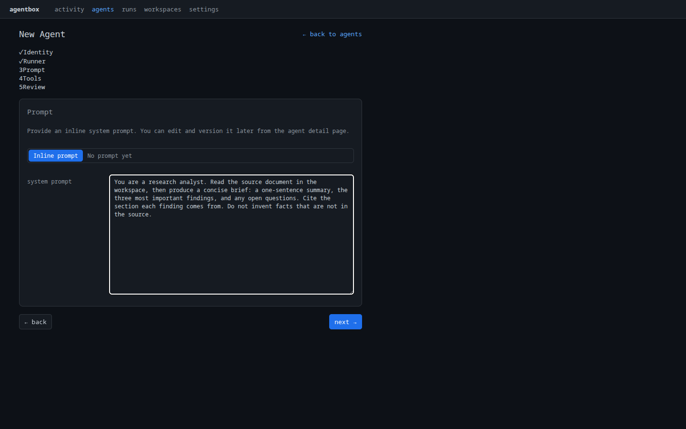
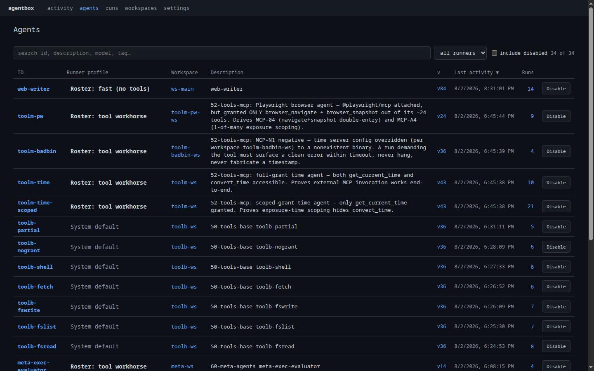
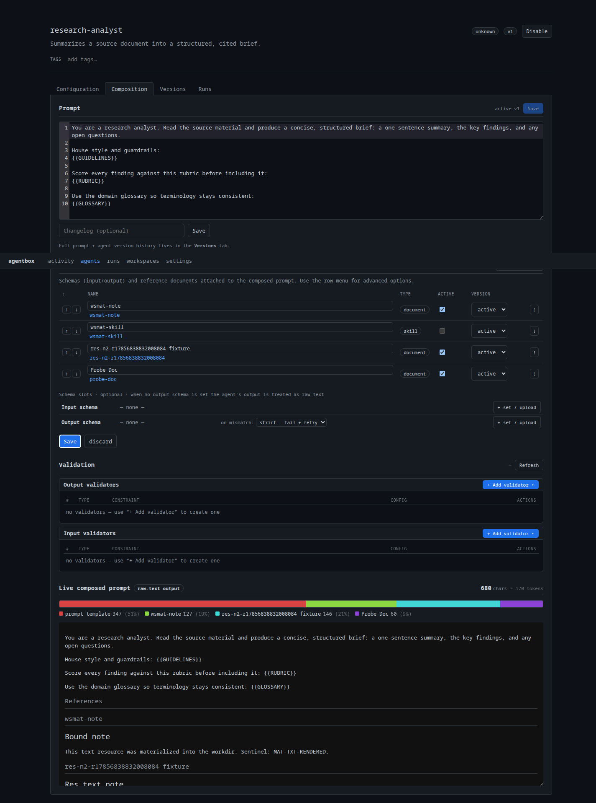
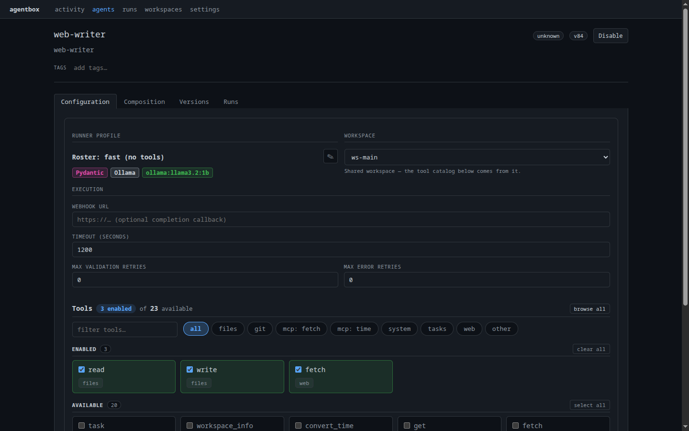
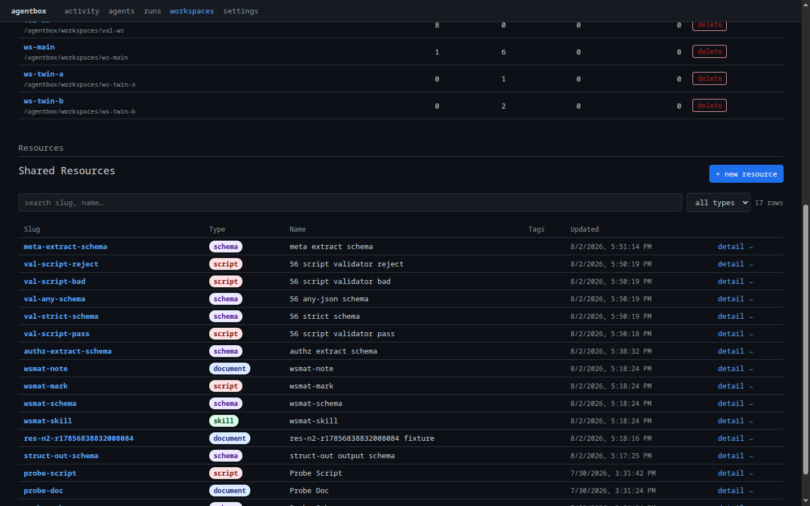
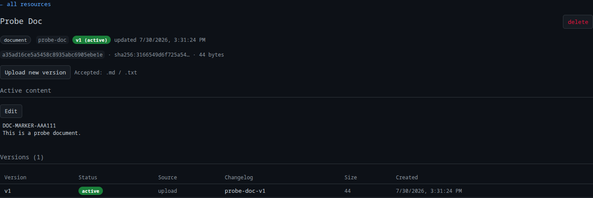
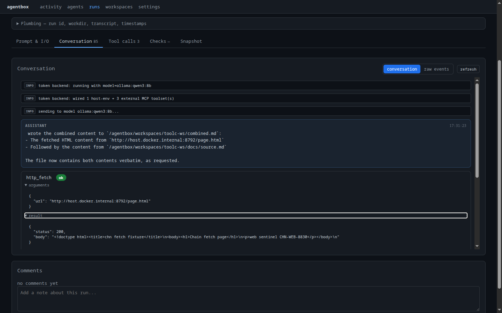
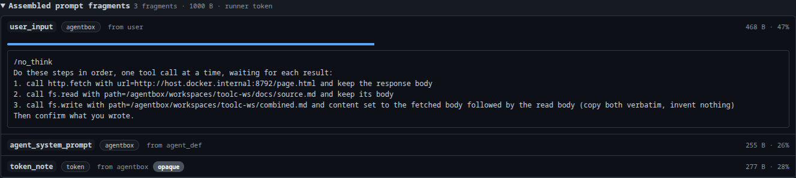

# Managing Agents

An **agent** is a named definition assembled from parts. At its core sits a
system prompt, but the prompt is rarely the whole story.

An agent attaches validation schemas that constrain what goes in and what comes
back, and resources (documents, scripts, skills) that the prompt draws on.

Those schemas and resources are reusable objects in their own right, so several
agents can share one output schema or one reference document.

AgentBox keeps all of it in a **database**. There are no agent files to manage:
the agent is composed and run right in the **dashboard**.

!!! info "Prerequisite"
    At least one provider has been configured in
    [2. Configuring a provider](02-setup-providers.md). This page runs the agent
    on the profile set up there (`MyRunnerProfile`).

## Create the agent

=== "Dashboard"

    Open **Agents → New agent**. A short wizard covers everything an
    agent needs, one step at a time:

    1. **Identity** — id, description, and optional tags.
    2. **Runner** — which backend executes it, the model, timeout, retry limits,
       and an optional output schema.
    3. **Prompt** — the inline system prompt (versioned from here on).
    4. **Tools** — which tools this agent may use.
    5. **Review** — confirm and create.

    <figure markdown>
      
      <figcaption>The New Agent wizard — Identity → Runner → Prompt → Tools → Review. The agent is written to the database and appears in the agent list immediately.</figcaption>
    </figure>

    Use these values:

    - **id:** `research-analyst`
    - **prompt:** *You are a research analyst. Given a paper or article, produce
      a concise, structured summary. Be specific and avoid filler.*

    Everything set here is editable later from the agent's detail page
    (Configuration / Composition / Tools tabs).

=== "API"

    ```bash
    curl -X POST http://localhost:8765/api/agents \
      -H 'content-type: application/json' \
      -d '{
        "id": "research-analyst",
        "description": "Summarizes research papers into structured output",
        "prompt": "You are a research analyst. Given a paper or article, produce a concise, structured summary. Be specific and avoid filler.",
        "runner": { "timeout_seconds": 1200 },
        "author": "you@example.com",
        "changelog": "initial draft"
      }'
    ```

Every agent lives in the **Agents** list, where any one can be searched,
filtered by runner, and opened to edit:

<figure markdown>
  
  <figcaption>The Agents list: every agent with its runner profile, workspace, active version, and run count.</figcaption>
</figure>

## Composition

AgentBox does not treat the prompt as one opaque string. It **composes** the
system prompt from fragments in a fixed order (base prompt, input schema,
references, output schema) and captures each fragment with its source, so the
exact input to the model is visible.

The agent's **Composition** tab is where this shows live. As resources are
bound, the **Live composed prompt** panel shows the fully assembled text and
a breakdown of how it was generated — every fragment's byte count and share of
the final prompt, so nothing about what the model sees is hidden.

<figure markdown>
  
  <figcaption>An agent with several resources bound: the prompt, the resource bindings, and the Live composed prompt chart showing each fragment's contribution to the generated text.</figcaption>
</figure>

Everything about an agent — its runner, execution limits, prompt, resources, and
tools — is editable from its detail page in the dashboard:

<figure markdown>
  
  <figcaption>The agent's Configuration tab: runner profile, workspace, execution limits, and the exact tool grant (Enabled vs Available), each with a description.</figcaption>
</figure>

### Attach resources

A **resource** is a typed input (document, schema, script, or skill) attached
once and reused.

Binding a resource instead of pasting text into the prompt means many agents
share one source of truth: update the resource, and every agent bound to it
picks up the new version.

!!! tip "In the dashboard"
    Manage reusable resources under **Resources** in the top nav, then bind one
    to an agent from its **Composition** tab (into the prompt) or to a workspace
    from the workspace page (as a file on disk). The API/CLI below does the same
    thing for scripts and automation.

<figure markdown>
  
  <figcaption>Shared Resources: every document, schema, script, and skill in one library, reusable across agents and workspaces. + new resource adds one.</figcaption>
</figure>

**1. Create and upload a resource:**

```bash
curl -X POST http://localhost:8765/api/repo-resources \
  -H 'content-type: application/json' \
  -d '{ "slug": "research-guide", "type": "document", "display_name": "Research Guide" }'

agentbox ops resource repo upload research-guide ./guidelines.md --changelog "initial"
```

**2. Bind it into the prompt** with a marker. Put `{{GUIDELINES}}` anywhere in
the system prompt and the resource content is substituted at compose time:

```bash
curl -X PUT http://localhost:8765/api/agents/research-analyst/prompt-resources \
  -H 'content-type: application/json' \
  -d '{
    "bindings": [
      { "resource_id": "research-guide", "marker": "{{GUIDELINES}}", "slot": "system", "mode": "inline", "required": true }
    ],
    "reason": "inline the research guide",
    "actor": "you@example.com"
  }'
```

Uploads are versioned (`agentbox ops resource repo show research-guide`,
`... rollback --version 1`). A resource can also be placed as a **file on disk**
in the workspace instead of inlining it, see [5. Workspaces](05-workspaces.md#bind-a-resource-into-a-workspace).

Each resource is a versioned object in its own right — open one to see its active
content, upload a new version, or roll back:

<figure markdown>
  
  <figcaption>A resource's detail page: type, active content, checksum, and the full version history — one source of truth that every agent bound to it shares.</figcaption>
</figure>

### Validation schemas

Schemas are resources too. Attach an input schema to constrain what a run
accepts, and an output schema to force the model into a validated shape.

Because a schema is a resource, one schema can back many agents. The output
schema is what turns free text into structured, checkable results, the subject
of the next page: [4. Structured, validated output](04-structured-output.md).

## Versioning

Every create makes **version 1**. Each later edit to the prompt or config
creates a new immutable version.

An agent therefore accumulates a line of versions that can be reviewed and
rolled back:

```bash
agentbox agent version ls research-analyst
agentbox agent prompt log research-analyst
agentbox agent prompt rollback research-analyst --to 1
```

Ratings and usage roll up per version, so whether a change helped is clear,
see [7. Evaluate & improve](07-evaluate.md#track-quality-across-versions).

### Run history

Separate from the version line is the **run history**: every invocation of the
agent, kept with its transcript, tokens, cost, and outcome.

This is the log to read to see how the agent behaves in practice.

```bash
agentbox history stat runs --range 30d --agent research-analyst
agentbox history stat usage --agent research-analyst
agentbox history show <run-id>
```

## Invoking an agent

An agent always carries a runner profile, so running one is just a matter of how
it is called. There are three ways in:

- **API** (the primary path): `POST /api/runs`, meant for programs and other
  services.
- **CLI**: `agentbox run research-analyst -p "..."` for a one-off headless run,
  or `agentbox run research-analyst` for an interactive TTY session.
- **Dashboard**: the dashboard is where runs are **watched and inspected** live
  and an existing one is **re-run** with the **↻ Rerun** button. New runs are launched
  from the API or CLI above; every one then shows up in the dashboard to browse.

Over the API, only `agent` is required; pass a `runner_profile` to override the
one bound to the agent:

```bash
curl -X POST http://localhost:8765/api/runs \
  -H 'content-type: application/json' \
  -d '{
    "agent": "research-analyst",
    "input": "Summarize this abstract on retrieval-augmented generation: ...",
    "runner_profile": "MyRunnerProfile"
  }'
```

`POST /api/runs` returns immediately with a `run_id`; the run executes
asynchronously.

The backend is resolved in this order: a **runner profile** passed on the run
(`runner_profile`), then the profile bound to the agent, then the instance's
system-default profile.

### Seeing the output

The dashboard streams the run as it happens. Over the API, the same events come
over a WebSocket:

```bash
websocat ws://localhost:8765/api/runs/run-abc123/stream
```

```json
{"type": "thinking", "run_id": "run-abc123", "text": "Reading the abstract..."}
{"type": "text", "role": "assistant", "text": "Summary: ...", "delta": true}
{"type": "usage", "input_tokens": 4200, "output_tokens": 640, "cost_usd": 0.0}
{"type": "done", "ok": true, "status": "ok"}
```

Event types: `text`, `thinking`, `tool_call`, `tool_result`, `usage`,
`validation`, `retry`, `timeout`, `log`, `done`. (Local Ollama runs report
`cost_usd` as `0.0`.)

<figure markdown>
  
  <figcaption>The run detail view: transcript, thinking, and tool calls captured in full.</figcaption>
</figure>

The composition shown on the agent is also captured **per run**: each run
records the exact fragments that went into its prompt and where each came from.

<figure markdown>
  
  <figcaption>The run's assembled prompt, fragment by fragment with its source — so precisely what this run's model received is visible.</figcaption>
</figure>

That streamed `text` is free-form. To get a **validated, structured** result
reliable in code, attach an output schema, which is the subject of the next page.

---

Next: **[4. Structured, validated output →](04-structured-output.md)**
