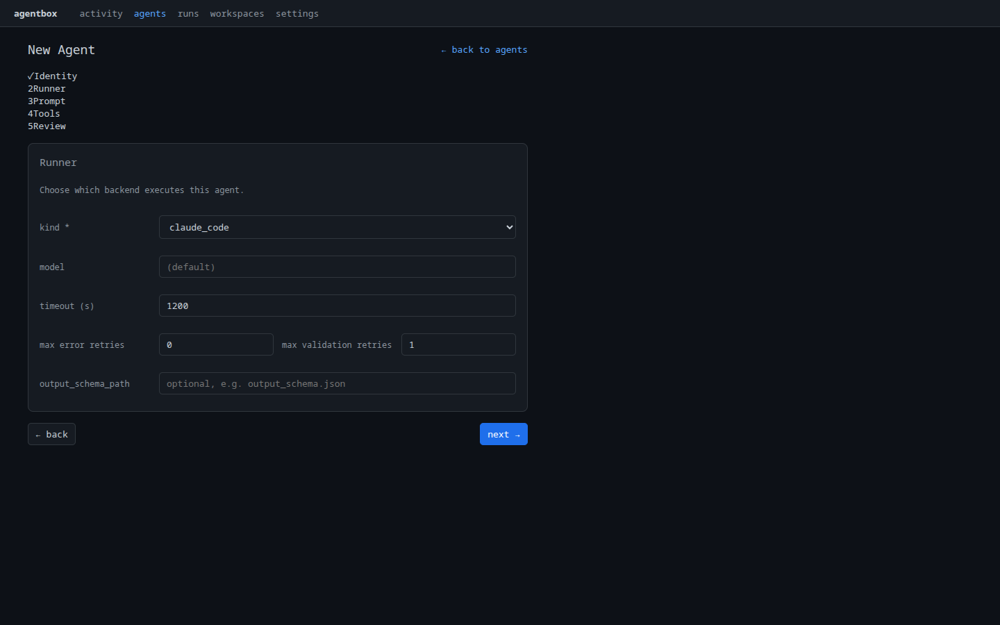

# Structured, validated output

A human-readable summary is nice; a summary that code can consume is better. When
an **output schema** is attached, AgentBox validates the agent's output against
it and, on a `strict` failure, re-runs with the validation error appended to the
prompt, up to a configured limit.

## Define the schema

```json title="output_schema.json"
{
  "type": "object",
  "required": ["title", "summary", "key_findings"],
  "properties": {
    "title": { "type": "string" },
    "summary": { "type": "string" },
    "key_findings": {
      "type": "array",
      "items": { "type": "string" }
    }
  }
}
```

## Attach it and enable validation

Attach the schema to the agent and turn on strict validation with retries.

=== "Dashboard"

    Open the agent's **Composition** tab. In **Schema slots**, use **+ set /
    upload** on the **Output schema** row to attach `output_schema.json`, and
    pick the on-mismatch mode (`strict` / `warn` / `off`) from the dropdown right
    there. The retry limit lives on the **Runner** step — set
    **max validation retries** when creating the agent, or on the Configuration
    tab afterwards.

    <figure markdown>
      
      <figcaption>The Runner step carries the schema and retry settings: <code>output_schema_path</code> and <code>max validation retries</code>.</figcaption>
    </figure>

=== "API / CLI"

    The agent's config carries two related settings:

    ```json title="agent config (composition + runner)"
    {
      "composition": { "output_schema": "output_schema.json", "output_validation": "strict" },
      "runner": { "output_schema_path": "output_schema.json", "max_validation_retries": 2 }
    }
    ```

    ```bash
    # Attach the schema file to the agent
    agentbox agent files add research-analyst --kind output_schema ./output_schema.json
    ```

| Setting | Meaning |
|---|---|
| `composition.output_validation` | `strict`, `warn`, or `off` |
| `runner.output_schema_path` | The schema to validate the output against |
| `runner.max_validation_retries` | Re-runs allowed on invalid output |

## What happens on a run

The stream shows a `validation` event, and if it fails, a `retry`
event before the next attempt:

```json
{"type": "validation", "ok": false, "attempt": 1, "mode": "strict", "engine": "jsonschema", "error": "key_findings: required"}
{"type": "retry", "attempt": 2, "reason": "validation_failed"}
{"type": "validation", "ok": true, "attempt": 2, "mode": "strict"}
```

The finished run records the outcome so it can be filtered on:

```bash
curl -s http://localhost:8765/api/runs/run-abc123 \
  | jq '{status: .run.status, validation: .run.validation_status, errors: .run.validation_errors}'
```

| Field | Meaning |
|---|---|
| `validation_status` | `ok` or `failed` after the final attempt |
| `validation_errors` | The schema errors, if any |

!!! tip "Warn instead of fail"
    Set `output_validation = "warn"` to record validation problems without
    re-running or failing the run. Use `strict` when a downstream system depends
    on the shape; use `warn` while the prompt is still being shaped.

!!! note "Input schemas too"
    The same mechanism validates **input**. Add an `input_schema` to the
    composition to reject malformed requests before the agent runs.

---

Next: **[5. Workspaces →](05-workspaces.md)**
