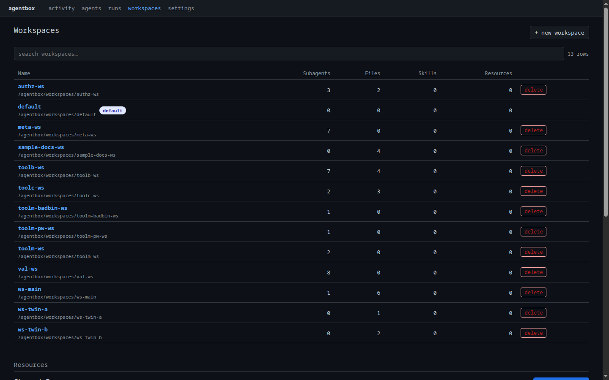
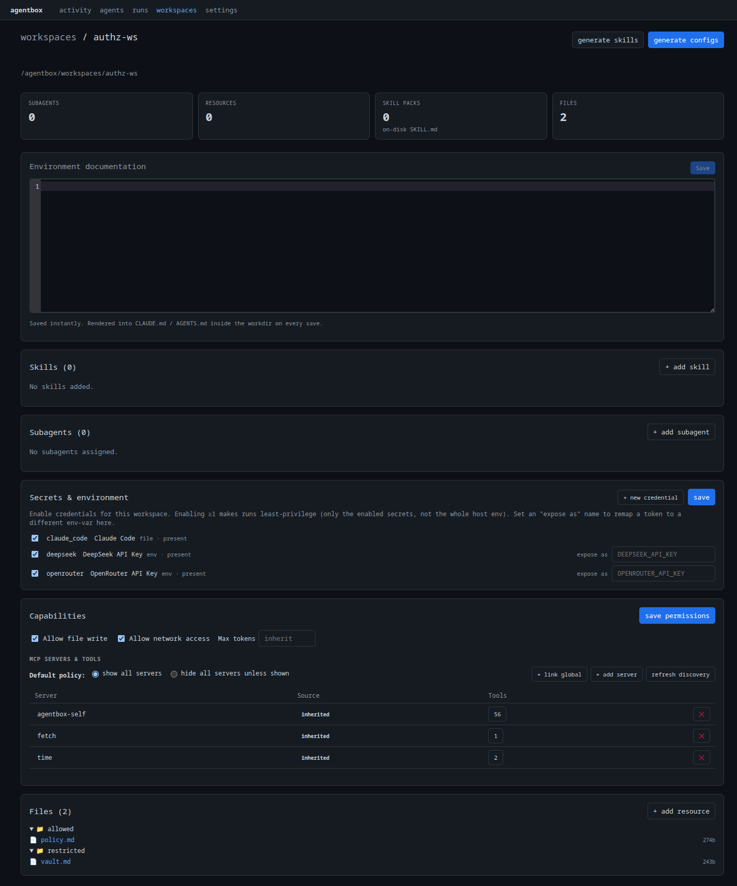

# Espacios de trabajo

Un **espacio de trabajo** es el entorno aislado (sandbox) en el que se ejecuta una
run. Contiene los archivos, herramientas, skills y recursos que un agente tiene
permitido tocar, y es la frontera de aislamiento entre un agente y otro.

Hay dos tipos:

| Tipo | Ciclo de vida | Úsalo para |
|---|---|---|
| **Efímero** | Creado nuevo por cada run, descartado después | Workers de un solo uso, experimentos en paralelo, runs limpias y reproducibles |
| **Persistente** | Con nombre, reutilizado entre runs | Trabajo iterativo, sesiones interactivas, arrastrar estado hacia adelante |

## Gestiona espacios de trabajo en el dashboard

La página **Workspaces** lista cada espacio de trabajo persistente con sus
recuentos de archivos, skills, subagentes y recursos. **+ new workspace** crea
uno; **delete** lo elimina.

<figure markdown>
  
  <figcaption>Cada espacio de trabajo persistente con su contenido de un vistazo; crea uno con + new workspace.</figcaption>
</figure>

Abre un espacio de trabajo para configurar todo lo que concede a una run:
documentación del entorno (renderizada a `CLAUDE.md` / `AGENTS.md`), skills,
subagentes, credenciales (secretos de mínimo privilegio), capacidades (escritura
de archivos / red / servidores y herramientas MCP) y los archivos vinculados a
él.

<figure markdown>
  
  <figcaption>La página de detalle del espacio de trabajo: documentación del entorno, skills, subagentes, credenciales acotadas, capacidades, concesiones de herramientas MCP y el árbol de archivos: toda la frontera de aislamiento en un solo lugar.</figcaption>
</figure>

La API y la CLI que aparecen a continuación hacen lo mismo para scripting y
automatización.

## Ejecuta en un entorno efímero

El modo efímero es el predeterminado cuando un espacio de trabajo no tiene
nombre, y puede forzarse de forma explícita. Nada de una run anterior se filtra.

=== "API"

    ```bash
    curl -X POST http://localhost:8765/api/runs \
      -H 'content-type: application/json' \
      -d '{
        "agent": "research-analyst",
        "input": "List the files you can see.",
        "runner_profile": "ollama",
        "fresh_workspace": true
      }'
    ```

    `fresh_workspace: true` fuerza un espacio de trabajo efímero limpio para esta run.

=== "CLI"

    ```bash
    agentbox run research-analyst -p "List the files you can see." --ephemeral
    ```

Como cada run efímera obtiene su propio directorio, dos agentes pueden trabajar
sobre la misma base en paralelo sin colisionar. Ejecutar el mismo POST dos veces
produce dos espacios de trabajo independientes y dos transcripciones
independientes.

## Crea un espacio de trabajo persistente

Nombra un espacio de trabajo cuando el estado deba sobrevivir entre runs (una
sesión interactiva, un repositorio clonado, archivos generados que valga la pena
inspeccionar).

=== "Dashboard"

    En la página **Workspaces**, haz clic en **+ new workspace**, dale un nombre y
    ábrelo para agregar archivos, skills y credenciales.

=== "CLI"

    ```bash
    # Create a workspace backed by a directory
    agentbox work ws new research --path /agentbox/workspaces/research

    # Inspect it
    agentbox work ws show research
    agentbox work ws explore research
    ```

=== "API"

    ```bash
    curl -X POST http://localhost:8765/api/workspaces \
      -H 'content-type: application/json' \
      -d '{"name": "research", "path": "/agentbox/workspaces/research"}'
    ```

Luego apúntalo en una run:

```bash
agentbox run research-analyst -p "Continue where we left off." --workspace research
```

!!! tip "Regenera la configuración del espacio de trabajo"
    AgentBox escribe configuración específica del backend (config de MCP,
    permisos, ubicación de skills) dentro del espacio de trabajo. Regenérala
    después de cambiar las vinculaciones:

    ```bash
    agentbox work file gen research
    ```

## Vincula un recurso a un espacio de trabajo { #bind-a-resource-into-a-workspace }

En [3. Gestión de agentes](03-first-agent.md#attach-resources) se vinculó un
recurso **al prompt** (en línea). La otra opción es colocarlo como un **archivo
en disco** dentro del espacio de trabajo: usa esto para esquemas, scripts o
archivos de referencia que el agente deba leer en una ruta. Esto reutiliza el
mismo recurso `research-guide`:

!!! tip "En el dashboard"
    Abre el espacio de trabajo y usa **+ add resource** en la sección **Files**
    para colocar un recurso en disco, eligiendo su ruta de destino. La llamada a
    la API que aparece a continuación es el equivalente scriptable.

```bash
curl -X PUT http://localhost:8765/api/workspaces/research/files \
  -H 'content-type: application/json' \
  -d '{
    "bindings": [
      {
        "resource_id": "research-guide",
        "target_path": "docs/guidelines.md",
        "materialize_mode": "copy",
        "on_conflict": "overwrite"
      }
    ],
    "reason": "share the research guide",
    "actor": "you@example.com"
  }'
```

| Campo | Valores | Significado |
|---|---|---|
| `materialize_mode` | `copy`, `symlink`, `mount` | Cómo aterriza el recurso en el espacio de trabajo |
| `on_conflict` | `error`, `overwrite`, `skip` | Qué hacer si el destino ya existe |

El mismo recurso puede vincularse a muchos espacios de trabajo: así es como
AgentBox *comparte* contexto entre entornos.

!!! warning "Frontera de aislamiento"
    Un espacio de trabajo es un acotamiento a nivel de sistema de archivos, **no**
    un sandbox a nivel de sistema operativo. Un backend con acceso a shell puede
    alcanzar el host. Consulta la
    [nota sobre aislamiento](01-setup-system.md#isolation).

---

Siguiente: **[6. Automatiza con webhooks →](06-webhooks.md)**
