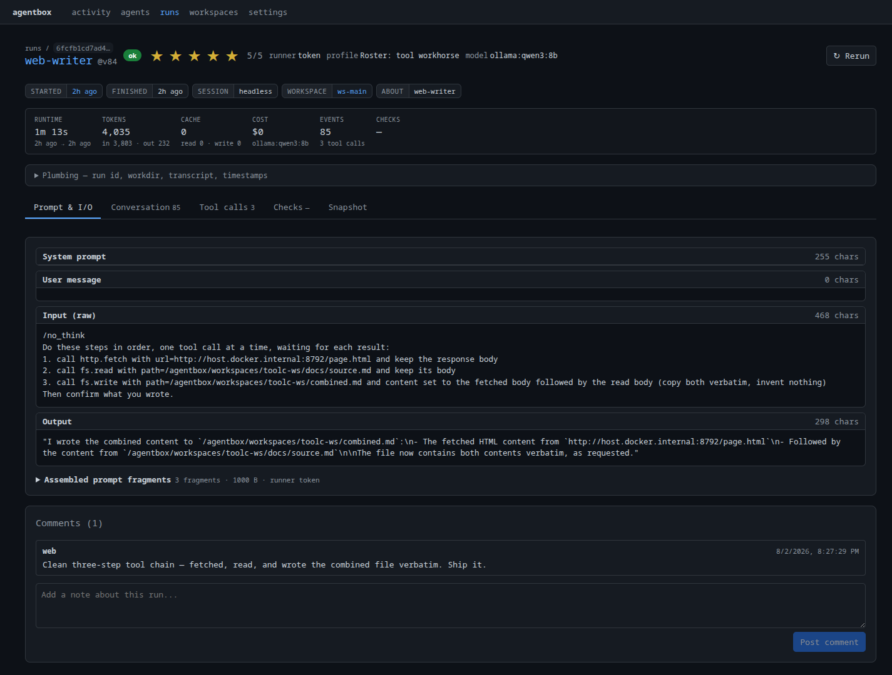
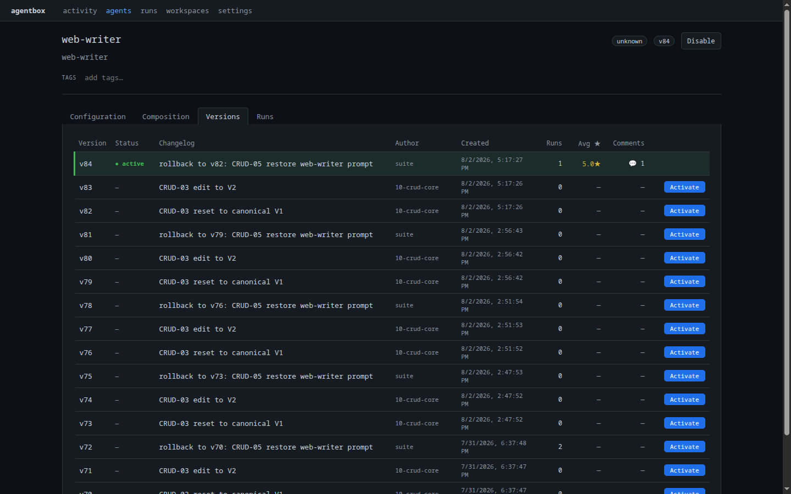

# Evaluar y mejorar

Cada ejecución se registra, así que la calidad es algo que se mide, no que se
adivina. El ciclo es: ejecútalo, puntúalo, cambia una sola cosa y deja que los
números registrados muestren si el cambio ayudó.

## Puntuar una ejecución { #score-a-run }

Califica una ejecución de 0 a 5 y adjunta un comentario.

=== "Dashboard"

    Abre cualquier ejecución. Haz clic en la **valoración por estrellas** del
    encabezado para puntuarla de 0 a 5, y añade una nota en el cuadro de
    **Comentarios** de la parte inferior. Ambas se guardan al instante y se
    consolidan en las estadísticas por versión.

    <figure markdown>
      
      <figcaption>Puntuar una ejecución de 0 a 5 con un comentario, para que la calidad sea medible.</figcaption>
    </figure>

=== "API"

    ```bash
    # Set a 0-5 rating
    curl -X PUT http://localhost:8765/api/runs/run-abc123/rating \
      -H 'content-type: application/json' \
      -d '{"rating": 4}'

    # Add a comment
    curl -X POST http://localhost:8765/api/runs/run-abc123/comments \
      -H 'content-type: application/json' \
      -d '{"author": "you@example.com", "body": "Good summary, missed one finding."}'
    ```

    Elimina una valoración con `DELETE /api/runs/run-abc123/rating`.

=== "CLI"

    ```bash
    agentbox history show run-abc123
    agentbox history log comments run-abc123
    ```

## Seguir la calidad entre versiones { #track-quality-across-versions }

Las valoraciones y el uso se consolidan por versión de agente. Después de
cambiar un prompt o de intercambiar un recurso, comparar versiones muestra si la
calidad media, los tokens o el tiempo variaron:

```bash
agentbox agent version ls research-analyst
agentbox history stat stats --agent research-analyst
```

<figure markdown>
  
  <figcaption>Valoración media, tokens y tiempo por versión de agente. ¿Ayudó el último cambio?</figcaption>
</figure>

## Mejorar añadiendo y compartiendo recursos

La mayoría de las mejoras son un cambio de prompt o un mejor recurso. El ciclo
de recursos:

1. **Crea / sube** un recurso (documento, esquema, script o skill):

    ```bash
    agentbox ops resource repo upload analysis-rubric ./rubric.md --changelog "v1"
    ```

2. **Vincúlalo** al espacio de trabajo (un archivo en disco) o al prompt
   (insertado, consulta [añadir recursos](03-first-agent.md#attach-resources)):

    ```bash
    agentbox agent prompt edit research-analyst
    ```

3. **Reutiliza** el mismo recurso en otro agente vinculando el mismo
   `resource_id`. Una única fuente de verdad; una sola actualización se propaga a
   todos los agentes que también lo vinculan.

Los scripts vinculados como recursos pueden exponerse al agente como
herramientas MCP, así que un recurso no es solo contexto. Puede ser capacidad.

!!! note "Versionado de prompts"
    Las ediciones de prompts se versionan. Revisa el historial y revierte si un
    cambio empeoró las cosas:

    ```bash
    agentbox agent prompt log research-analyst
    agentbox agent prompt rollback research-analyst --to 3
    ```

---

Siguiente: **[Intercambiar harnesses y comparar →](08-compare.md)**
