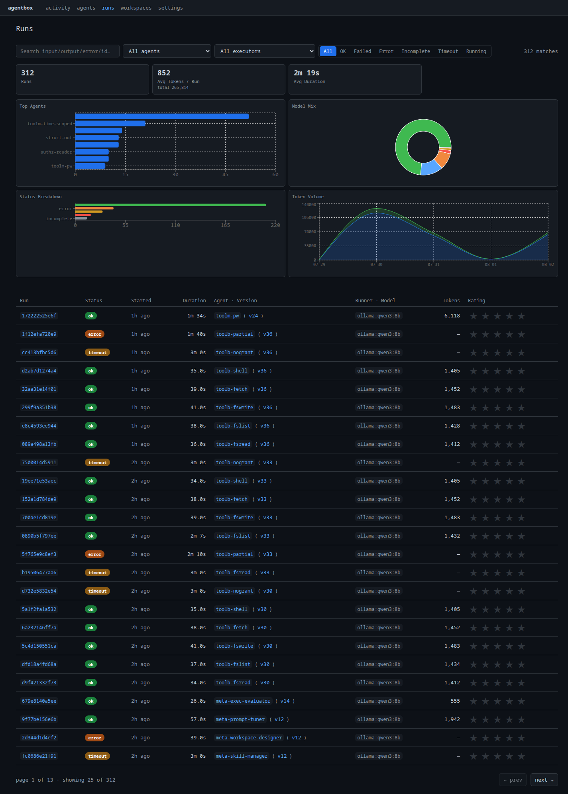
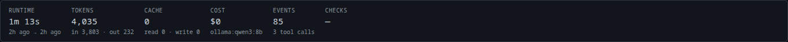

# Cambia de harness y compara

Como un agente se compone de un prompt, recursos y un esquema, la
definición es independiente del harness que lo ejecuta. El mismo
`research-analyst` se ejecuta hoy en OpenCode y mañana en Claude Code: solo cambia
el backend. Y como cada ejecución se captura con tokens, coste y
tiempo, AgentBox puede comparar esos harnesses cara a cara.

## Cambia el backend por ejecución

No hace falta editar el agente. Sobrescribe `backend` (y opcionalmente `model`) en la
ejecución:

=== "OpenCode"

    ```bash
    curl -X POST http://localhost:8765/api/runs \
      -H 'content-type: application/json' \
      -d '{"agent": "research-analyst", "input": "Summarize ...", "backend": "opencode"}'
    ```

=== "Claude Code"

    ```bash
    curl -X POST http://localhost:8765/api/runs \
      -H 'content-type: application/json' \
      -d '{"agent": "research-analyst", "input": "Summarize ...", "backend": "claude_code"}'
    ```

=== "CLI"

    ```bash
    agentbox run research-analyst -p "Summarize ..." --backend opencode
    ```

!!! note "Los backends en la nube necesitan credenciales"
    OpenCode, Claude Code, Codex y Pi ejecutan sus propios CLIs y necesitan
    credenciales del proveedor. Configúralas una sola vez: consulta [Configurar un proveedor](02-setup-providers.md).

El mismo prompt, el mismo esquema, los mismos recursos, pero un ejecutor distinto. La
ejecución capturada registra qué `backend` y `reported_model` se ejecutaron realmente.

### Qué se conserva entre backends y qué revisar

| Elemento | ¿Se conserva entre backends? | Notas |
|---|---|---|
| Prompt compuesto | Sí | Se ensambla de la misma forma independientemente del backend |
| Esquema de salida + validación | Sí | Lo impone AgentBox, no el backend |
| Recursos (documentos, esquemas) | Sí | Ligados al espacio de trabajo/prompt, independientes del backend |
| Skills | Sí | Colocados donde cada backend los detecta automáticamente (`.claude/`, `.opencode/`, ...) |
| Herramientas MCP | Sí, si el backend admite MCP | `claude_code`, `opencode` y `token` admiten MCP; `codex` y `pi` son limitados |
| Nombres de herramientas nativas | Revisar | Cada backend expone sus propias herramientas nativas; mantén `allowed_tools` portable |
| Modelo | Específico del backend | Un alias de modelo válido para un proveedor no lo es para otro |

!!! tip "Marca los backends que un agente debe omitir"
    ```toml
    [agent]
    unsupported_backends = ["codex", "pi"]
    ```

## Compara tokens, tiempo y calidad

Ejecuta la misma entrada en cada backend y luego compara las ejecuciones capturadas.

```bash
for be in opencode claude_code codex; do
  curl -s -X POST http://localhost:8765/api/runs \
    -H 'content-type: application/json' \
    -d "{\"agent\": \"research-analyst\", \"input\": \"Summarize the RAG paper.\", \"backend\": \"$be\"}"
done
```

!!! tip "En el panel"
    La página **Runs** está pensada exactamente para esta comparación. Filtra por un solo agente
    y luego lee los gráficos **Model Mix**, **Token Volume** y **Status Breakdown**
    y la tabla por ejecución (estado, duración, tokens y calificación en paralelo)
    para ver qué backend ganó, sin necesidad de scripts.

    <figure markdown>
      
      <figcaption>La página Runs: mezcla de modelos, volumen de tokens, desglose de estados y una tabla por ejecución con calificaciones en línea, el lado visual de la comparación de más abajo.</figcaption>
    </figure>

Califica cada ejecución terminada de 0 a 5 (consulta [Evaluar y mejorar](07-evaluate.md#score-a-run)). Cada ejecución
expone los campos relevantes en `GET /api/runs/{id}`:

| Campo | Significado |
|---|---|
| `backend` / `reported_model` | Qué harness y modelo se ejecutaron realmente |
| `usage.input_tokens` / `output_tokens` | Tokens de prompt y de completado |
| `usage.cache_read_tokens` / `cache_write_tokens` | Actividad de la caché de prompts |
| `usage.cost_usd` | Coste calculado de la ejecución |
| `usage.duration_ms` | Tiempo de reloj |
| `rating` | La puntuación de calidad de 0 a 5 |

<figure markdown>
  
  <figcaption>El panel de uso: tokens de entrada/salida/caché y coste de una ejecución.</figcaption>
</figure>

### Agrupa las cifras por backend

```bash
curl -s "http://localhost:8765/api/runs?agent=research-analyst&limit=200&paginated=true" \
  | jq '[.items[] | {backend, model: .reported_model, cost: .cost_usd, ms: .duration_ms, rating}]
        | group_by(.backend)
        | map({backend: .[0].backend,
               runs: length,
               avg_cost: (map(.cost // 0) | add / length),
               avg_ms:   (map(.ms // 0)   | add / length),
               avg_rating: (map(.rating // 0) | add / length)})'
```

```json title="Example result"
[
  {"backend": "claude_code", "runs": 10, "avg_cost": 0.021, "avg_ms": 7800, "avg_rating": 4.3},
  {"backend": "opencode",    "runs": 10, "avg_cost": 0.014, "avg_ms": 9100, "avg_rating": 3.8},
  {"backend": "codex",       "runs": 10, "avg_cost": 0.011, "avg_ms": 6400, "avg_rating": 3.5}
]
```

Ahora la disyuntiva es explícita: `claude_code` cuesta más pero obtiene la puntuación más alta;
`codex` es el más barato y rápido pero de menor calidad. Elige según la carga de trabajo.

### Resúmenes agregados

=== "API"

    ```bash
    curl -s "http://localhost:8765/api/runs/_stats?agent=research-analyst&since=2026-07-01"
    ```

    ```json title="RunStatsRow"
    {
      "run_count": 30, "success_count": 28, "failure_count": 2,
      "avg_duration_ms": 8450, "total_input_tokens": 126000,
      "total_output_tokens": 19200, "total_cost_usd": 3.71, "distinct_models": 3
    }
    ```

=== "CLI"

    ```bash
    agentbox history stat usage --agent research-analyst
    agentbox history stat runs --range 30d --agent research-analyst
    agentbox history stat activity --range 30d --agent research-analyst
    ```

## Mueve un agente entre instancias de AgentBox

Comparte el agente completo (prompt, configuración y archivos) exportándolo e importándolo:

```bash
# On the source instance
agentbox mat export research-analyst --to ./exported/research-analyst

# On the target instance
agentbox mat import research-analyst --from ./exported/research-analyst
```

Como las skills, los recursos y el esquema viven todos fuera del harness, "qué
harness" se convierte en una decisión de tiempo de ejecución: justo lo que se necesita cuando aparece un nuevo backend
o un proveedor cambia sus precios.

---

Siguiente: **[Trabaja de forma interactiva →](09-interactive.md)**
