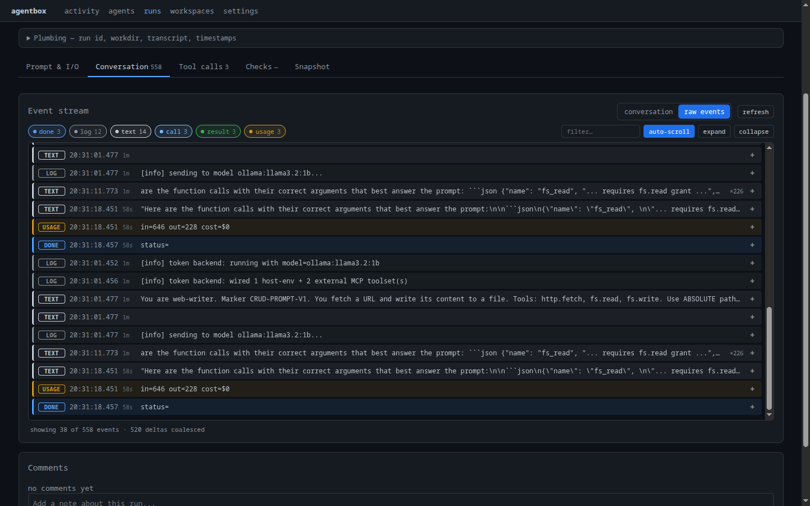

# Work interactively

Everything so far ran an agent **headless**: one shot, output over the API. But
the same isolated, resource-scoped environment can host a **live interactive
session**. The operator drives the backend's own CLI (Claude Code, OpenCode, ...)
inside the agent's workspace, with its tools, skills, and MCP config already in
place.

This is the priority use case for iterative work: full control of the
environment, the whole session captured, and no distractions the agent should
not have.

## Headless vs interactive

Agents declare a `session_mode`:

| `session_mode` | Behavior |
|---|---|
| `headless` | One-shot run; input and output through the API |
| `persistent` | Long-lived session driven interactively over a terminal |

## Launch a custom OpenCode session

The goal for this walkthrough: an OpenCode TUI running in a specific workspace,
exposing only a chosen few agents as subagents. Nothing else from the library is
visible inside the session.

**1. Create (or reuse) a persistent workspace** so files, history, and state
carry across sessions:

```bash
agentbox work ws new research --path /agentbox/workspaces/research
```

**2. Add only the agents this session should see.** A workspace exposes a
selected set of agents to the backend as subagents. Bind just the desired ones,
each as an object with an `agent_id` and an `alias`:

```bash
curl -X PUT http://localhost:8765/api/workspaces/research/subagents \
  -H 'content-type: application/json' \
  -d '{
    "subagents": [
      { "agent_id": "web-writer", "alias": "web-writer", "display_order": 0 },
      { "agent_id": "authz-reader", "alias": "authz-reader", "display_order": 1 }
    ]
  }'
```

Only these two appear inside the session; the rest of the agents stay out.

!!! note "A subagent needs a prompt to render"
    An agent shows up only if its active version has prompt content. Agents with
    an empty prompt are silently skipped when the workspace config is composed.

**3. Regenerate the workspace config** so the subagent refs land where OpenCode
discovers them (`.opencode/`):

```bash
agentbox work file gen research
```

**4. Launch OpenCode in the workspace.** This is an ad-hoc session (no top-level
agent), pinned to the `opencode` backend and the `research` workspace:

```bash
agentbox run --backend opencode --workspace research
```

The session opens in the OpenCode TUI, scoped to `research`, with `web-writer`
and `authz-reader` available as subagents and nothing else.

!!! tip "Running in a container?"
    OpenCode and the CLI live inside the container, so launch the TUI there:

    ```bash
    docker exec -it agentbox-sample \
      agentbox run --backend opencode --workspace research
    ```

    Steps 1-3 run over the API against whatever host port you mapped the service
    to in your `docker-compose`.

### Resume a session

```bash
agentbox run --backend opencode --workspace research --session-id sess-abc123
```

!!! tip "Tied to a single agent instead?"
    To open a session in an agent's own backend and workspace, run it without a
    prompt: `agentbox run research-analyst`. The session opens in that agent's
    harness (for example the Claude Code TUI), already scoped to its resources,
    skills, and tools.

The session runs in the harness's own **TUI** in the operator's terminal — that
part is not the dashboard. But the session is captured the same as any run, and the
dashboard shows it **live**: the event stream ticks over the WebSocket as work
proceeds, then stays fully browsable afterward (transcript, tool calls, usage).

<figure markdown>
  
  <figcaption>The dashboard's live event stream for a session — text, tool calls, and usage streaming over the WebSocket, filterable and browsable after it ends.</figcaption>
</figure>

## What the session provides

- The agent's **composed prompt**, resources, and skills, already placed where
  the backend expects them.
- Only the **allowed tools**. Grant or revoke without leaving:

    ```bash
    agentbox agent tool ls research-analyst
    agentbox agent tool grant research-analyst shell.exec
    ```

- The MCP servers configured for the workspace (internal host tools plus any
  connected external MCP):

    ```bash
    agentbox work mcp show research
    agentbox work mcp tools research
    ```

- Full **capture** of the session, the same as a headless run: transcript,
  usage, and timing, browsable afterward in the dashboard and via
  `agentbox history`.

## Which backends support it

| Backend | Interactive |
|---|---|
| `claude_code` | Yes, full TUI |
| `opencode` | Yes, full TUI |
| `codex` | Limited |
| `pi` | Limited, no full terminal |
| `token` | No, in-process, no CLI |

!!! warning "It is still not an OS-level sandbox"
    An interactive session with `shell.exec` granted can reach the host
    filesystem and network. Scope tools deliberately and only run trusted agents
    interactively. See the [isolation note](01-setup-system.md#isolation).

## Drop into a plain workspace shell

To poke around the environment without launching an agent:

```bash
agentbox work ws shell research     # shell in the workspace
agentbox work ws explore research   # browse its files
```

---

That completes the journey: AgentBox is set up, a provider is configured, a first
agent is created and run, structured output is enforced, work happens in isolated
workspaces, runs are automated with webhooks, harnesses are evaluated and
compared, and a live interactive session is driven, all from one captured,
controllable backend.

Back to **[Overview](index.md)**.
